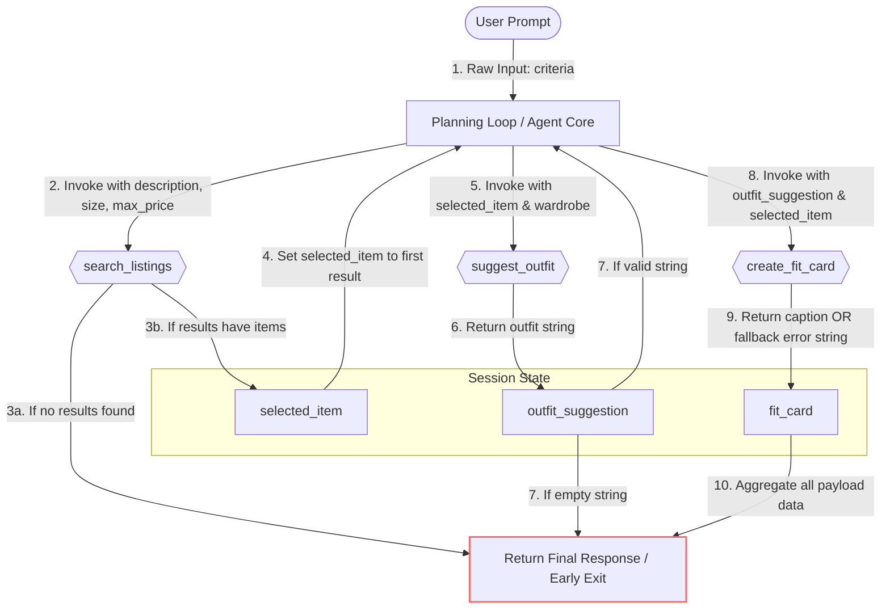

# FitFindr — planning.md

> Complete this document before writing any implementation code.
> Your spec and agent diagram are what you'll use to direct AI tools (Claude, Copilot, etc.) to generate your implementation — the more specific they are, the more useful the generated code will be.
> Your planning.md will be reviewed as part of your submission.
> Update it before starting any stretch features.

---

## Tools

List every tool your agent will use. For each tool, fill in all four fields.
You must have at least 3 tools. The three required tools are listed — add any additional tools below them.

### Tool 1: search_listings

**What it does:**
Searches the mock thrift listings dataset to find clothing items that match the user's description. It applies strict filtering based on maximum budget and size (if provided), scores the remaining items by keyword overlap with the description, and returns the relevant results ranked from highest to lowest score.

**Input parameters:**
- `description` (str): Keywords describing the item the user is looking for (e.g., `"vintage graphic tee"`). **Required**.
- `size` (str | None): Optional size string to filter by (e.g., `"M"`). Matching is case-insensitive and supports partial matches (e.g., `"M"` matches `"S/M"`). Defaults to `None` (skips size filtering).
- `max_price` (float | None): Optional maximum price ceiling (inclusive). Defaults to `None` (skips price filtering).

**What it returns:**
A list of matching listing dictionaries sorted by relevance (best match first). Each dictionary contains the following fields: `id`, `title`, `description`, `category`, `style_tags` (list), `size`, `condition`, `price` (float), `colors` (list), `brand`, and `platform`.

**What happens if it fails or returns nothing:**
If no listings match, the agent returns a helpful user message recommending broader search terms or a higher budget and does not call `suggest_outfit`. 

---

### Tool 2: suggest_outfit

**What it does:**
Generates outfit recommendations using an LLM by pairing a selected thrifted item with pieces from the user's existing wardrobe.

**Input parameters:**
- `new_item` (dict): A listing dictionary representing the thrifted clothing item the user is considering buying.
- `wardrobe` (dict): A wardrobe dictionary containing an `'items'` key, which maps to a list of existing wardrobe item dictionaries. The `'items'` list can be empty.

**What it returns:**
A non-empty string containing 1–2 complete outfit suggestions. If wardrobe items are available, the recommendations will reference specific, named pieces from the user's closet. If the wardrobe is empty, it returns general styling advice, vibes, and pairing ideas for the new item.

**What happens if it fails or returns nothing:**
If the wardrobe or its `'items'` list is empty, the tool handles it gracefully by falling back to general styling guidance. It does NOT raise an exception or return an empty string.

---

### Tool 3: create_fit_card

**What it does:**
Creates a short, social-media-style caption inspired by the outfit recommendation and the thrifted item details. The caption is designed to be shareable on platforms such as Instagram or TikTok.

**Input parameters:**
- `outfit` (str): The outfit suggestion generated by `suggest_outfit`. **Required**.
- `new_item` (dict): The listing dictionary for the thrifted item. **Required**.

**What it returns:**
A 2–4 sentence string usable as a social media caption. The caption naturally mentions the item's name, price, and resale platform exactly once each, while capturing the specific vibe of the outfit without sounding like a rigid product advertisement.

**What happens if it fails or returns nothing:**
If the `outfit` string is empty, missing, or contains only whitespace, the function handles the error gracefully and returns a descriptive error message string. It does NOT raise an exception.

---

### Additional Tools (if any)

No additional tools are required for Milestone 1.

---

## Planning Loop

**How does your agent decide which tool to call next?**
FitFindr determines its next action through a strict, sequential decision-making process driven by data validation guards rather than an open-ended reactive loop. The agent begins the workflow by extracting the user's search criteria—such as description, size, and maximum price—and immediately invoking `search_listings()`. To decide whether to proceed or stop, the agent evaluates the structural outcome of this search; if the returned list is completely empty, a conditional branch is triggered where the agent stops the workflow early and generates a message advising the user to broaden their search parameters. Conversely, if the list contains one or more results, the agent locks in the highest-ranked item as `selected_item = results[0]` and advances to the next logical step.

Once the item is selected, the behavior of the agent is guided by the evaluation of content validity. It automatically retrieves the user's wardrobe data and executes `suggest_outfit(selected_item, wardrobe)`, pausing to verify the string response of the tool. If the outfit suggestion is empty or consists of only whitespace, the agent recognizes a generation failure and routes directly to the end of the pipeline, skipping the captioning phase entirely to avoid further errors. If a valid, non-empty suggestion is returned, the agent moves forward with its final enrichment task by calling `create_fit_card(outfit_suggestion, selected_item)` to produce a social-media caption.

The agent knows the planning loop is complete when all executed tool outputs converge into a finalized response structure. Whether `create_fit_card()` succeeds or gracefully returns a descriptive error message due to upstream issues, the agent aggregates the available data—the listing details, the outfit recommendation, and the resulting caption or error text—into a single, unified Markdown payload for the user, marking the execution cycle as fully done.

---

## State Management

**How does information from one tool get passed to the next?**
<!-- Describe how your agent stores and accesses state within a session. What data is tracked? How is it passed between tool calls? -->

---

## Error Handling

For each tool, describe the specific failure mode you're handling and what the agent does in response.

| Tool | Failure mode | Agent response |
|------|-------------|----------------|
| search_listings | No results match the query | |
| suggest_outfit | Wardrobe is empty | |
| create_fit_card | Outfit input is missing or incomplete | |

---

## Architecture

<!-- Draw a diagram of your agent showing how the components connect:
     User input → Planning Loop → Tools (search_listings, suggest_outfit, create_fit_card)
                                                                          ↕
                                                                   State / Session
     Show what triggers each tool, how state flows between them, and where error paths branch off.
     ASCII art, a Mermaid diagram (https://mermaid.js.org/syntax/flowchart.html), or an embedded
     sketch are all fine. You'll share this diagram with an AI tool when asking it to implement
     the planning loop and each individual tool. -->

This diagram illustrates the sequential execution pipeline of the FitFindr agent, detailing data flow payloads, state updates within the session, and early termination guard clauses.

---

## AI Tool Plan

<!-- For each part of the implementation below, describe:
     - Which AI tool you plan to use (Claude, Copilot, ChatGPT, etc.)
     - What you'll give it as input (which sections of this planning.md, your agent diagram)
     - What you expect it to produce
     - How you'll verify the output matches your spec before moving on

     "I'll use AI to help me code" is not a plan.
     "I'll give Claude my Tool 1 spec (inputs, return value, failure mode) and ask it to implement
     search_listings() using load_listings() from the data loader — then test it against 3 queries
     before trusting it" is a plan. -->
     

### Milestone 3 — Individual Tool Implementations
For this milestone, I will use ChatGPT (or Claude) to implement and refine each individual tool one by one, based closely on the behavioral contracts specified in `planning.md`.

#### Tool: `search_listings()`
* **AI Tool Used:** ChatGPT (or Claude)
* **Inputs Provided to AI:**
  * Tool 1 section from `planning.md` (inputs, outputs, explicit failure behaviors).
  * The expected mock listings schema from `data/listings.json`.
  * The technical requirement to utilize `load_listings()` from `utils/data_loader.py`.
  * Core filtering rules: case-insensitive size matching, maximum price ceiling, keyword scoring, and relevance sorting.
* **Expected Output:** A fully implemented Python function that loads listings, filters appropriately by size and max price, computes a simple keyword overlap relevance score, drops 0-score matches, and returns the sorted list of dictionaries (or `[]` if empty).
* **Verification Strategy:** Test with at least 3 sample queries (e.g., `"graphic tee"`, `"hoodie"`, `"cargo pants"`). Confirm that an empty result cleanly returns `[]` without crashes, size filtering successfully excludes mismatched sizes, price caps are respected, and the array is ordered descending by best match first.

#### Tool: `suggest_outfit()`
* **AI Tool Used:** Claude
  
* **Inputs Provided to AI:**
  * Tool 2 section from `planning.md`.
  * Wardrobe schema structure from `data/wardrobe_schema.json` and the `get_example_wardrobe()` reference.
  * Selected item structure resulting from `search_listings()`.
  * Clear instructions detailing behavioral requirements for empty vs. populated wardrobe states.
* **Expected Output:** A Python function that checks if `wardrobe["items"]` is empty, formats available wardrobe pieces into a structured prompt, invokes the Groq client (`_get_groq_client()`), and gracefully generates fallback general styling advice if the closet is empty.
* **Verification Strategy:** Execute test cycles using an empty wardrobe payload (validating general advice output) and a populated wardrobe payload (ensuring the LLM explicitly references real, named items from the closet). Verify prompt sanitization so no exceptions are raised if structural fields are missing.

#### Tool: `create_fit_card()`
* **AI Tool Used:** Claude
  
* **Inputs Provided to AI:**
  * Tool 3 section from `planning.md`.
  * Real sample outputs generated by `suggest_outfit()` alongside the target listing dictionary fields (`title`, `price`, `platform`).
  * Strict stylistic constraints: social media "OOTD" caption voice, casual tone, and a length boundary of 2–4 sentences.
    
* **Expected Output:** A function that validates the incoming outfit string (guarding against empty/whitespace blocks), builds a specialized prompt for the Groq LLM, and produces a casual caption naturally integrating the item name, price, and resale platform exactly once.
  
* **Verification Strategy:** Test with a valid outfit string to confirm appropriate social media copy generation, and test with an empty string to ensure it catches the guard clause and returns a clean error message. Manually check that name, price, and platform are natively included without sounding repetitive across test runs.

---

### Milestone 4 — Planning Loop and State Management
* **AI Tool Used:** Claude
  
* **Inputs Provided to AI:**
  * The complete Planning Loop, State Management, and architectural logic sections from `planning.md`.
  * The sequential agent state architecture diagram (Mermaid graph rendering the early termination paths).
  * An end-to-end example execution flow blueprint (Search $\rightarrow$ Outfit $\rightarrow$ Fit Card) and explicit error routing definitions.
    
* **Expected Output:** A centralized agent/controller orchestration module. It must parse raw strings into tokens, call `search_listings()`, perform conditional branching (triggering an early termination return message if `[]`), handle dictionary-based session state management, and invoke downstream tools sequentially before assembling the finalized Markdown response payload.
  
* **Verification Strategy:** Run a full end-to-end test cycle using a valid query. Trace execution to guarantee proper sequential tool invocation and verify that the early-exit route executes cleanly on empty search triggers. Inspect the dictionary-based session state object after each step to guarantee no values are mutated unexpectedly or passed forward with missing parameters, matching the system diagram exactly.

---

## A Complete Interaction (Step by Step)

Write out what a full user interaction looks like from start to finish — tool call by tool call. Use a specific example query.

**Example user query:** "I'm looking for a vintage graphic tee under $30. I mostly wear baggy jeans and chunky sneakers. What's out there and how would I style it?"

**Step 1:**
The agent calls `search_listings(description="vintage graphic tee", size="M", max_price=30.0)` to find matching listings in `data/listings.json`.

**Step 2:**
`search_listings` returns a ranked list of matches such as a black tour-style graphic tee, a Y2K butterfly tee, and a faded band tee. The agent selects the top result and passes it to `suggest_outfit` along with the user's wardrobe loaded from `get_example_wardrobe()`.

**Step 3:**
`suggest_outfit(new_item=<selected listing>, wardrobe=<user wardrobe>)` returns a styling recommendation like pairing the tee with baggy dark wash jeans and chunky white sneakers, plus notes on how to wear the look.

**Step 4:**
The agent calls `create_fit_card(outfit=<styling suggestion>, new_item=<selected listing>)` to generate a concise fit-card caption summarizing the new item and the outfit mood.

**Final output to user:**
The user receives a complete response: the matched listing headline and price, the outfit suggestion using their wardrobe, and a fit-card style caption. If no listings match, the agent instead tells the user to broaden the search or raise the budget and stops without suggesting an outfit.

